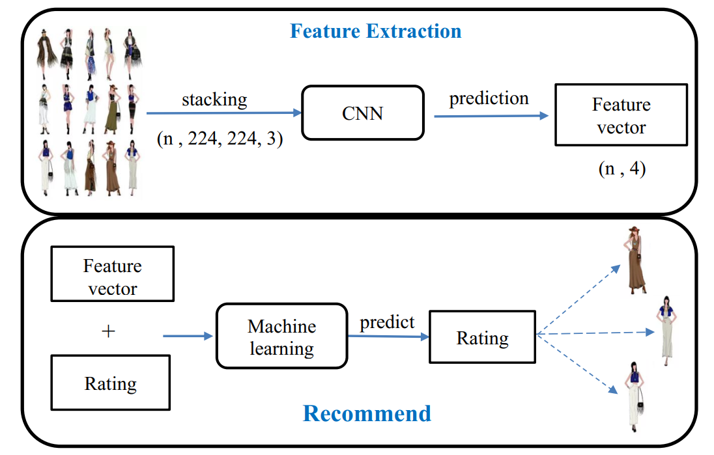

## Hệ thống khuyến nghị dựa trên hình ảnh sử dụng CNN

**Giới thiệu:**

Dự án này giới thiệu một hệ thống khuyến nghị dựa trên hình ảnh sử dụng mạng nơ-ron tích chập (CNN) để trích xuất đặc trưng và mô hình học máy để xây dựng hệ khuyến nghị.

**Kiến trúc:**

Hệ thống được chia thành hai phần chính:

**1. Mô hình trích xuất đặc trưng:**

Sử dụng kiến trúc VGG-19 được đào tạo trước trên tập dữ liệu ImageNet. VGG-19 được sử dụng để trích xuất các đặc trưng hình ảnh từ lớp cuối cùng của mạng VGG-19, trước lớp phân loại.

Để chọn ra mô hình CNN cùng với thuật toán tối ưu phù hợp, nhóm tiến hành thực nghiệm trên một tập dữ liệu nhỏ. Bảng dưới đây là kết quả của lần thực nghiệm cuối cùng với thuật toán tối ưu là Adam.

| Model | Train acc | Val acc | Test acc |
|---|---|---|---|
| VGG-16 | 0.86 | 0.53 | 0.51 |
| AlexNet | 0.8 | 0.46 | 0.43 |
| Xception | 0.6 | 0.38 | 0.3 |
| VGG-19 | 0.98 | 0.46 | 0.48 |
| EfficientNet | 1.00 |0.57|0.54|
| ResNet50 |1.00|0.57|0.56|
| ResNet152 |1.00|0.53|0.52|
| ResNet152V2 |0.21|0.19|0.20|
| DenseNet121 |0.64|0.35|0.34|
| DenseNet201 |0.86|0.37|0.40|

Chúng tôi chọn VGG-19 kết hợp với Adam vì phù hợp với điều kiện phần cứng của chúng tôi. Đây là kết quả đào tạo trên tập dữ liệu đầy đủ.

|  | Dropout | Learning rate | Accuracy |
|---|---|---|---|
| VGG-19 | 0.5 | 0.001 | 0.8539 |

**2. Mô hình khuyến nghị:**

Sử dụng thuật toán XGBoost (Extreme Gradient Boosting) để xây dựng mô hình khuyến nghị. XGBoost được huấn luyện trên các đặc trưng hình ảnh được trích xuất từ VGG-19 cùng với đánh giá của mỗi người mua hàng. Từ đó mô hình đưa ra dự đoán đánh giá cho các sản phẩm khác.

Chúng tôi tiến hành thực nghiệm với nhiều thuật toán khác nhau và dùng độ đo RMSE (Root Mean Squared Error) để đánh giá. Sau cùng thì XGBoost cho kết quả tốt so với thời gian tính toán. Đây là bảng kết quả thực nghiệm của chúng tôi.

|  | Rigde | SVM | Extra Tree | Decision Tree | Random Forest | Gradient Boosting | XGBoost |
|---|---|---|---|---|---|---|---| 
| Train acc | 1.251 |1.339|1.462|1.464|1.455|1.458|1.459 |
| Test acc |1.649|1.589|1.53|1.532|1.522|1.526|1.523|
| Thời gian (s) |4|3|4|4|119|64|16|

**Dữ liệu**

Chúng tôi sử dụng bộ dữ liệu Amazon Product. Đây là bộ dữ liệu chứa thông tin sản phẩm được bán trên Amazon. Bộ dữ liệu kéo dài từ tháng 5 năm 1996 đến tháng 7 năm 2014, bao gồm 9,4 triệu sản phẩm. Chúng tôi đã thu thập một bộ dữ liệu gồm 5 nghìn sản phẩm, thuộc 4 danh mục là: Clothing Men, Clothing Women, Shoes và Watches. Bạn có thể tải bộ dữ liệu đầy đủ [tại đây](https://snap.stanford.edu/data/amazon/productGraph/).

## Thông tin liên hệ
Nếu bạn có câu hỏi hoặc muốn đóng góp cho dự án, vui lòng liên hệ qua email: [syvipko42@gmail.com](mailto:syvipko42@gmail.com).
